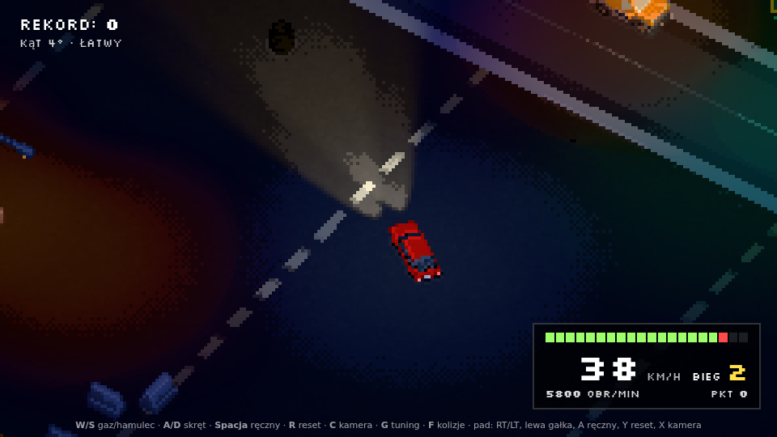
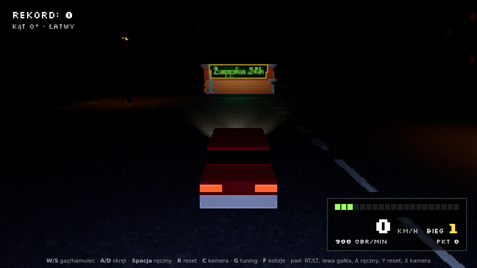

# Agro Drifter 🇵🇱 (v0.4)

Przeglądarkowa gra o driftowaniu Polonezem nocą po osiedlu: pixel-art 3D z kamerą jak nad dioramą
i ucieczka przed „promieniowaniem 5G” (opis projektu i roadmapa w [`CLAUDE.md`](CLAUDE.md)).




*Zrzuty z headless Chromium (renderer programowy SwiftShader); na prawdziwej karcie graficznej obraz może się nieco różnić.*

Zasada projektu: **składamy gotowe klocki zamiast pisać własne**.

| Warstwa | Gotowiec | Co z niego bierzemy |
|---|---|---|
| Render | [three.js](https://threejs.org) | scena, `MeshToonMaterial` (cieniowanie w kilku stopniach) |
| Pixel-art | przykład three.js [`webgl_postprocessing_pixel`](https://threejs.org/examples/#webgl_postprocessing_pixel) | `RenderPixelatedPass` (pikselizacja + obrysy z głębi i normalnych), kamera ortograficzna przyciągana do siatki pikseli; do tego `UnrealBloomPass`, `OutputPass` i mały `ShaderPass` (stopnie jasności + dithering) |
| Noc | `THREE.Fog` z podmienionym chunkiem shadera, `SpotLight`, `PointLight` | mgła radialna wokół auta (czerń dookoła), reflektory, latarnie, świecący szyld |
| Auto | [„1993 FSO Polonez MR93 (LP)”](https://sketchfab.com/3d-models/1993-fso-polonez-mr93-lp-f191456e08a041ad81264ce67f4ed1d1) (Sketchfab) | model z kołami na kościach (kręcą się i skręcają) |
| Osiedle | [Kenney City Kit Roads / Commercial / Suburban, Car Kit, Starter Kit City Builder](CREDITS.md) (CC0) | drogi, latarnie, bloki, pawilony, sklep, garaże, zaparkowane auta, drzewa (`GLTFLoader`) |
| Konwersja modeli | [glTF-Transform](https://gltf-transform.dev) | `npm run assets` (usunięcie logo, fikcyjna tablica, `.glb` → `.gltf`) |
| Dźwięk | [Howler.js](https://howlerjs.com) + dźwięki z Kenney Starter Kit Racing (CC0) | silnik, pisk opon, uderzenia |
| Czcionka HUD | [Silkscreen](https://fonts.google.com/specimen/Silkscreen) przez `@fontsource/silkscreen` (OFL) | pikselowy licznik |
| Fizyka | [Rapier](https://rapier.rs) (`@dimforge/rapier3d-compat`) | świat, kolizje, raycast, debug render |
| Model jazdy i kamera | [Kenney Starter Kit Racing](https://github.com/KenneyNL/Starter-Kit-Racing) (MIT) | auto jako toczona kula + model podążający za nią, kamera z opóźnieniem (przeniesione z GDScript do TypeScript) |
| Tuning | [lil-gui](https://lil-gui.georgealways.com) | suwaki, presety, eksport/import JSON (klawisz **G**) |
| Pad | Gamepad API przeglądarki | analogowy gaz, hamulec i skręt |
| Dotyk | [nipplejs](https://github.com/yoannmoinet/nipplejs) | joystick skrętu na telefonie |
| Ostrzeżenie baterii | Web Audio (przez kontekst Howlera) | krótki pisk generowany w kodzie, bez pliku |
| Testy | `node:test` (wbudowany w Node ≥ 22.18, czyta TypeScript) | scenariusze jazdy bez przeglądarki |
| Typy | [TypeScript](https://www.typescriptlang.org) | `vehicle.ts`, `camera.ts`, `tuning.ts`; sprawdzanie `npm run typecheck` |
| Build | [Vite](https://vite.dev) | dev server z HMR, produkcyjny build |

## Uruchomienie

```bash
npm install
npm run dev      # http://localhost:5173
npm test         # testy jazdy i kamery (Node, ~8 s)
npm run assets   # przebudowa modeli z assets-src/ (potrzebny program unzip)
npm run typecheck
npm run build    # statyczny build do dist/
```

## Sterowanie

| | Klawiatura | Pad |
|---|---|---|
| Gaz / hamulec (wsteczny) | W / S | RT / LT |
| Skręt | A / D | lewa gałka |
| Ręczny | Spacja | A lub RB |
| Reset auta | R | Y |
| Kamera (Diorama / Za autem) | C | X |
| Panel tuningu | G | Start |
| Podgląd kolizji (Rapier debug render) | F | — |
| Długie / krótkie światła | L | krzyżak w górę |
| Misja od nowa | N | Back |
| Zamknij podsumowanie misji | Enter | — |
| Pauza | P / Esc | — |

Po R, C i automatycznym wypchnięciu z przeszkody na środku ekranu pojawia się krótki komunikat.
Dźwięk startuje po pierwszym klawiszu/kliknięciu (wymóg przeglądarek). Parametr `?spawn=x,z,kąt` w adresie ustawia auto w innym miejscu,
`?bat=5` startuje z 5% baterii (do sprawdzenia migania i gaśnięcia).

## Menu, garaż, ustawienia

Gra startuje w **menu głównym**: Graj (misja 1 od początku), Kontynuuj (od ostatniego kroku misji i punktu zapisu), Garaż, Ustawienia.
- **Garaż:** Polonez obraca się pod gołą żarówką; lakier wybierasz z palety z epoki.
- **Ustawienia:** grafika (piksele Drobne / Średnie / Grube, ekspozycja, jakość), dźwięk (głośności), sterowanie (poziom jazdy
  Łatwy / Normalny / Pro, klawisze do zmiany: kliknij przycisk i naciśnij nowy klawisz, lista przycisków pada).
- **Pauza:** Esc (albo P, Start na padzie, ❚❚ na dotyku): Wznów, Restart misji, Ustawienia, Wyjście do menu. Gra pauzuje się też sama, gdy karta/aplikacja przejdzie w tło.
- Ustawienia i postęp zapisują się w przeglądarce (localStorage); bez niego gra działa normalnie, tylko nie pamięta.
- `?graj` w adresie pomija menu (testy).

**Zegary** w prawym dolnym rogu wyglądają jak deska rozdzielcza auta z lat 70–80: prędkościomierz 0–160, obrotomierz ×1000 z czerwonym
polem, bateria jak stary zegar paliwa (0 – ½ – 1), kontrolki (ładowanie driftem, światła: zielona krótkie / niebieska długie,
silnik: miga przy niskiej baterii, świeci po zgaśnięciu, ręczny), okienko biegu i bębenkowy licznik punktów.

**Obraz:** kamera Diorama patrzy 35° w dół i jest obrócona 28° od osi mapy (suwaki w panelu G). Rozmiar piksela dobiera się do
wysokości ekranu: Średnie ≈ 360 linii (1080p: piksel 3), Drobne ≈ 540, Grube ≈ 240.

## Telefon i tablet (wersja testowa)

Na urządzeniu dotykowym (wykrywanym po możliwościach ekranu, nie po nazwie przeglądarki) pojawia się sterowanie dotykowe.
Na komputerze nic się nie zmienia; `?touch=1` w adresie włącza je do testów, `?touch=0` wyłącza.

- **Lewa połowa ekranu:** joystick skrętu pojawia się tam, gdzie położysz kciuk (tylko w bok, proporcjonalnie).
  W panelu (G → „Wydajność”) można zamiast niego wybrać przyciski ◀ ▶, które narastają jak klawisze.
- **Prawa strona:** GAZ, HAMULEC / wsteczny i RĘCZNY. Działa kilka palców naraz (gaz + ręczny + skręt).
- **U dołu:** pełny ekran (⛶; na Androidzie gra próbuje też zablokować poziom), pauza, reset, kamera, panel.
- **W pionie** zasłania grę plansza „Obróć telefon” (iPhone nie pozwala stronie zablokować orientacji).
- **Wydajność:** na dotyku jakość jest od razu niska (większy piksel, bez bloomu, co druga latarnia bez światła). Licznik FPS
  i przełącznik jakości są w panelu, w folderze „Wydajność”.
- **Pauza:** gra staje, gdy aplikacja przejdzie w tło; na telefonie wracasz dotknięciem, na komputerze sama rusza po powrocie. P / Esc też pauzuje.

Roadmapa (dopracowanie sterowania mobilnego w v0.15): [`ROADMAP.md`](ROADMAP.md).

## Jak jeździć driftem (preset „Normalny”, domyślny)

Normalna jazda trzyma przyczepność: zwykły zakręt, nawet pełny skręt z gazem, nie wywoła poślizgu. Poślizg zaczyna się dopiero od:
- **ręcznego** (Spacja) ze skrętem od ~40 km/h,
- **odpuszczenia gazu** w szybkim zakręcie od ~54 km/h (masa przechodzi na przód, tył ucieka),
- **pełnego gazu z pełnym skrętem** od ~61 km/h.

W poślizgu nic nie trzyma kąta za ciebie:
- gaz wypycha tył dalej, **kontra** (skręt przeciwny do zakrętu) zmniejsza kąt; drift trzymasz kontrą i gazem jednocześnie;
- za mało gazu – auto się prostuje i łapie przyczepność; skręt w zakręt albo puszczona kontra – kąt rośnie aż do **obrotu** (powyżej 65°);
- za mocna kontra przy wyjściu **zarzuca w drugą stronę**; wyjście z wyczuciem: odpuść gaz i lekko kontruj;
- auto ma **pęd**: w szybkim zakręcie i w drifcie wynosi je na zewnątrz, więc da się przestrzelić zakręt.

Presety (G → Preset, później w menu Ustawienia): **Normalny** (domyślny), **Pro** (wyższe progi, tył ucieka szybciej, obrót od 55°)
i **Łatwy** – dawna jazda z asystą (kąt trzyma się sam, bez bączków), jako opcja dostępności.

**Uderzenia:** przeszkody zderzają się z karoserią auta (prostokąt 4,3 × 1,7 m) i mają kolizję dokładnie taką, jak wyglądają.
Przejazd tuż obok lampy nic nie robi, a zahaczenie jej rogiem to uderzenie. Po uderzeniu auto zatrzymuje się na przeszkodzie
i lekko odbija, zależnie od materiału: od drzewa najsłabiej, potem beton, metal (lampy, śmietniki, płoty), zaparkowane auta,
a od opon i plastikowych barierek najmocniej. Silnik przez chwilę nie pcha w przeszkodę; cofanie działa od razu.
Suwaki: `crashRebound`, `crashStun`, `crashMinSpeed` w „Wygląd jazdy i kontakt”.
Awaryjne wypchnięcie zostało tylko na wypadek zakleszczenia (np. auto wstawione w szparę węższą od siebie).

W obu presetach przednie koła w drifcie same pokazują kontrę (skręcone przeciwnie do zakrętu, o tyle, ile wynosi kąt driftu).

**Auto** czyta profil z `src/cars/polonez.json`: realne dane Poloneza 1500 (82 KM, 114 Nm, 1110 kg, RWD, 4 biegi 3,75/2,30/1,49/1,00,
155 km/h) i wartości do gry (108 km/h, jak dotąd, żeby prowadzenie się nie zmieniło). Z niego biorą się masa i moc kuli, biegi
i obroty na liczniku, model i paleta lakierów. Nowe auto = nowy plik JSON w `src/cars/`. Lakier z epoki (domyślnie beż) wybierzesz
w panelu, w folderze „Auto”.

W panelu są też foldery:
- **Grafika (noc, pixel-art):** rozmiar piksela, obrysy, stopnie jasności, dithering, drżenie PS1 (domyślnie wyłączone), ekspozycja, mgła, światła, lakier Poloneza;
- **Kamera Diorama** i **Kamera Za autem**;
- **Dźwięk**.

Przycisk **Eksport ustawień (JSON)** kopiuje wszystkie parametry do schowka (i pokazuje je w okienku), a **Wczytaj JSON** wczytuje wklejone.

## Bateria, Żappka i misja 1

- **Bateria** szybko się rozładowuje: bez driftu auto gaśnie po ok. 80 s jazdy przy 54 km/h (64 s przy 80 km/h, szybciej na długich, L).
  Ładuje ją **tylko porządny drift**: co najmniej 20° i 32 km/h, tym szybciej, im większy kąt i prędkość i im dłużej drift jest czysty
  (30° przy 54 km/h: +2% w pierwszej sekundzie, +5,5% w czwartej). Uderzenie przerywa serię i na 2 s blokuje ładowanie.
  W praktyce: co ok. 30 s potrzebujesz 2–3 dobrych driftów.
- **Reflektory** słabną razem z baterią; poniżej 20% migoczą, poniżej 10% pasek miga i słychać pisk.
- **0%:** silnik gaśnie, auto się toczy, ekran ciemnieje, komunikat, restart z ostatniego punktu zapisu (z co najmniej 30% baterii).
- **Żappka 24h:** zatrzymaj się na świecącym zielonym polu przed wejściem. Bateria ładuje się do 100% (ok. 2 s) i tu zapisuje się punkt odrodzenia.
- **Misja 1 „Paczka”** startuje sama: narrator (u góry ekranu) wprowadza w klimat, cel i odległość są w lewym górnym rogu, nad celem stoi
  żółty słup światła, a nad autem strzałka. Kroki: odbierz paczkę z Paczkoboxu przy Bloku 1 → naładuj baterię driftem do 70%
  (duży parking) → dowieź paczkę pod Blok 2 → wróć na pole przed Żappką. Na końcu podsumowanie: czas i punkty za drift.
  Misja to plik `src/missions/paczka.json` (kroki, cele, teksty narratora), a punkty celów są w pliku mapy.
- Wszystkie liczby są w panelu (G), w folderze „Bateria i misja”.

## Punktacja

HUD w prawym dolnym rogu: prędkość, wirtualny bieg, obrotomierz i punkty. Biegi są tylko na pokaz i do dźwięku, fizyka ich nie ma.

Punkty rosną z kątem poślizgu × prędkością, a mnożnik co 2 s ciągłego driftu. Po ~1,2 s bez driftu punkty trafiają do wyniku.
Uderzenie w przeszkodę (od ~20 km/h) w trakcie driftu = punkty przepadają. Rekord zapisywany w `localStorage`.

## Struktura

Opis modułów i modelu jazdy: [`CLAUDE.md`](CLAUDE.md#architektura-v03). Fizyka auta jest zamknięta w `src/vehicle.ts`
z prostym interfejsem wejście/wyjście, więc reszta gry nie zależy od biblioteki fizycznej.

## Deploy

Workflow `.github/workflows/pages.yml` publikuje build na GitHub Pages po pushu na `main`
(w ustawieniach repo: *Settings → Pages → Source: GitHub Actions*).

## Znane ograniczenia

- Bundle ma ~5 MB (1,8 MB gzip), bo `rapier3d-compat` wbudowuje WASM w JS. Modele to kolejne ~8 MB `.gltf` (base64). Do optymalizacji później.
- Misje: na razie jest jedna i gra startuje ją automatycznie (wybór misji w v0.4).
- Kolizja karoserii z przeszkodami to prostokąt w rzucie z góry (bez zaokrągleń i bez wysokości): liczy się obrys auta na ziemi.
- Model Poloneza ma licencję Sketchfab Standard, a nie CC0 (szczegóły w CREDITS).
- Dźwięki są w `.ogg`: starsze Safari ich nie odtworzy.
- Bez GPU sprawdzone tylko zrzutami (SwiftShader); płynność i jasność na prawdziwej karcie trzeba ocenić samemu.

Assety i licencje: [`CREDITS.md`](CREDITS.md).
