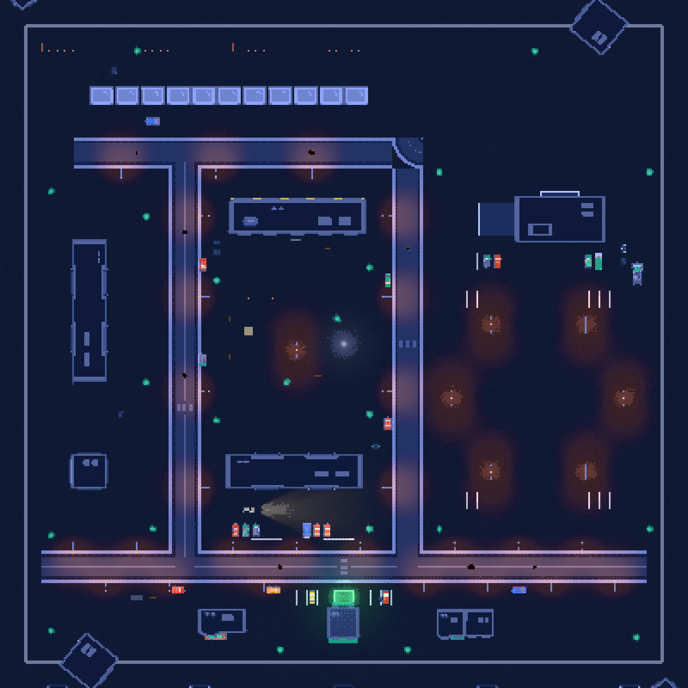

# Plan osiedla – Osiedle Kosmonautów (v0.4c)

Mapa gry to plik [`src/maps/osiedle.json`](../src/maps/osiedle.json). Ten dokument to plan, z którego jest zbudowana:
szkic, strefy i zasady. Assety to tymczasowo Kenney City Kit (bloki = rozciągnięte budynki), do podmiany później.

Siatka 10 m, x rośnie na wschód, z na południe (północ = góra szkicu). Teren 200 × 200 m, betonowy płot na ±100 m.
Jedna kratka szkicu = 10 m.

```
        -100      -80       -60       -40       -20        0        20        40        60        80       100
   -100  +---------------------------------------------------------------------------------------------------+
         |  ~ drzewa ~                                                                                        |
    -80  |      [G][G][G][G][G][G][G][G][G][G][G]  <- garaże (drzwi na południe)       ~~ drzewa ~~           |
         |      .  .  .  .  place przed garażami .  .  .                          +-----------------------+   |
    -60  |    ==============================================+=====================|  SUPERSAM (market)    |   |
         |    ul. Tereszkowej               *   ||    ___   ||                    +-----------------------+   |
    -40  |  +---+                  [BLOK 1 ============]  ||                  :: parking pod marketem ::   |
         |  | B |   *              [P] paczkomat          ||                  ::                        ::   |
    -20  |  | L |  ||      o trzepak   ~   ~               ||                  ::   duży plac do driftu  ::   |
         |  | O |  ||   ~  PODWÓRKO: plac zabaw, ławki  ~ ||                  ::   (latarnie w rzędach) ::   |
      0  |  | K |  ||      piaskownica  huśtawka   *      ||                  ::                        ::   |
         |  | 3 |  ||   ~         o trzepak         ~     ||                  ::                        ::   |
     20  |  +---+  ||                                     ||                  ::                        ::   |
         |   *    ||               [BLOK 2 ============]  ||                  ::                        ::   |
     40  | [B4]   ||                                     ||                  ::                        ::   |
         | wieża  ||   parking przed Blokiem 2 [][][][]  ||                  ::________________________::   |
     60  |  *     ||  *        *        *        *       ||      *        *        *        *            |
     70  | ===============+====================== ul. Kosmonautów (główna) ===+===========================  |
     80  |  [przystanek]   *   [PAWILON]  *  [pp][ŻAPPKA 24h][pp]  *  [PAWILON]  *        *               |
         |                                     (pole zapisu)                                                  |
    100  +---------------------------------------------------------------------------------------------------+
   ||  = uliczki osiedlowe: ul. Lotników (x = −50) i ul. Gagarina (x = 20), obie od głównej na północ do ul. Tereszkowej
   *   = latarnie (główna: po obu stronach), ~ = drzewa, [pp] = miejsca parkingowe, o = trzepak
```

## Strefy

| Strefa | Gdzie | Co jest | Po co w grze |
|---|---|---|---|
| **Ulica główna** (ul. Kosmonautów) | z = 70, całą szerokością | latarnie po obu stronach co ~20 m, przystanek, przejście dla pieszych przy Żappce, zaparkowane auta przy krawężniku | szybki przejazd, dojazd do sklepu |
| **Uliczki osiedlowe** | ul. Lotników (x = −50), ul. Gagarina (x = 20), ul. Tereszkowej (z = −60) | latarnie po jednej stronie, auta przy krawężnikach, dziury | dojazd do bloków, garaży, marketu |
| **Kwartał bloków** | między Lotników a Gagarina | Blok 1 i Blok 2 równolegle do siebie (wschód–zachód), między nimi podwórko | cele misji, klimat |
| **Podwórko** | między Blokiem 1 i 2 | plac zabaw (piaskownica, huśtawka), trzepaki, ławki, drzewa, latarnia | tło, przeszkody do slalomu |
| **Parking przed Blokiem 2** | pas przy ul. głównej | miejsca parkingowe z liniami, zaparkowane auta | start misji |
| **Zachód** | za ul. Lotników | Blok 3 (długi, wzdłuż ulicy) i Blok 4 (punktowiec/wieża) | cel dostawy (Blok 4) |
| **Garaże** | północny skraj, przy ul. Tereszkowej | rząd 11 blaszaków z placem przed wjazdami, śmietniki | garaż w menu, klimat |
| **Market „Supersam” i plac** | wschód, za ul. Gagarina | market na północy placu, wielki pusty parking z rzędami latarń, kilka aut pod wejściem | główne miejsce do driftu (ładowanie baterii) |
| **Pierzeja handlowa** | południe, przy głównej | pawilony, **Żappka 24h** z parkingiem i świecącym polem zapisu, przystanek | punkt zapisu, koniec misji |

## Zasady układu

- Wszystko na siatce 10 m; ulice to proste odcinki w pliku (`roads`), kafle skrzyżowań i łuków dobierają się same.
- Nic nie stoi na jezdni: test (`test/map.test.mjs`) sprawdza, że pas ruchu każdej ulicy jest wolny, a cele misji dostępne.
- Zaparkowane auta tylko na parkingach i przy krawężnikach (poza pasem ruchu).
- Rzeczy są pogrupowane: śmietniki przy blokach i garażach, paczkomat przy wejściu do Bloku 1, ławki i trzepaki na podwórku.
- Kolizje: obrys geometrii modelu na wysokości karoserii (0,1–2,2 m), więc drzewo zderza się pniem, a latarnia słupem.

## Misja 1 „Paczka” na tej mapie

Start: parking przed Blokiem 2 → paczkomat przy wejściu do Bloku 1 → ładowanie driftem (plac pod Supersamem) →
dostawa pod Blok 4 (wieża przy ul. Lotników) → pole przed Żappką 24h.


